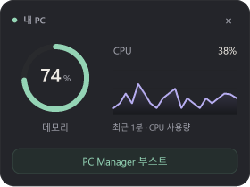

  

<h1 align="center">Mongle (몽글)</h1>

  <b>코딩하는 당신 옆의 몰랑한 데스크톱 펫</b> 
  AI 코딩 에이전트가 일하면 같이 일하고, 끝나면 점프하며 알려줍니다.

  
  
  
  
  

---

## PC 상태 카드와 표시 설정

*그래프와 수치는 테스트 데이터로 만든 화면 예시입니다.*

- **켜고 끄기**: 설정 창 또는 트레이 메뉴의 `캐릭터 표시`, `PC 상태 카드`를 각각 선택합니다. 카드의 ×를 누르면 카드만 꺼지고, 트레이에서 다시 켤 수 있습니다.
- **크기**: `PC 카드 크기`에서 작게(기본)·보통·크게를 고릅니다. 캐릭터 크기와 별도로 적용됩니다.
- **이동·상세 수치**: 카드 전체를 잡아 옮기고, 메모리 링에 마우스를 올리면 사용 중인 용량과 전체 RAM을 확인합니다.
- **기록과 정리**: 그래프는 최근 CPU 측정값 최대 21개만 메모리에 보관합니다. 카드 종료 시 버리며, 임시 파일 삭제나 메모리 정리 기능은 포함하지 않습니다.

OpenCodex 다중 계정은 사용량 창에서 각각 구분됩니다. 계정 정보 표시를 끄면 이메일 대신 계정 번호가 보이고, 갱신되지 않은 한도는 `갱신 대기`로 표시합니다. 활동 로그에서는 같은 작업의 서브에이전트를 한곳에 모아 볼 수 있으며, 세션 표시를 끄면 시간순으로 돌아옵니다.

## 최근 업데이트

### 0.8.3

- **PC 상태 카드·사용량 HUD 가림 복구** — 처음에는 맨 위에 보이다가 다른 창 아래에 숨어 남아 있던 문제를 수정했습니다. 창 순서를 주기적으로 복구합니다.
- **작업 흐름 유지** — 복구할 때 키보드 포커스와 카드 위치·크기를 유지합니다. 캐릭터를 숨겨도 동작하며, 숨긴 카드나 드래그 중인 카드에는 개입하지 않습니다.

### 0.8.2

- **Rust 네이티브 교체판** — 기존 Electron 자동 업데이트 채널을 그대로 사용해 `Mongle.exe`, `%APPDATA%/mongle`, 제품 GUID와 시작 메뉴 항목을 유지하면서 Rust/Win32 앱으로 전환합니다.
- **가벼운 설치 파일** — Electron/Chromium 런타임을 동봉하지 않는 Rust 패키지로 교체했습니다. 기존 설정과 앱 데이터는 보존하고 남은 Electron 파일은 설치 중 정리합니다.
- **업데이트 흐름 유지** — 업데이트는 계속 백그라운드로 내려받고, 카드나 트레이에서 `설치 후 재시작`을 선택할 때만 조용히 설치한 뒤 Mongle을 다시 실행합니다.
- **네이티브 UI 정리** — 설정/활동/사용량/PC 상태 창을 Win32 네이티브 화면으로 옮기고, 우클릭 메뉴의 하위 메뉴 화살표 여백과 선택 색을 다듬었습니다.

### 0.8.1

- **PC 상태 카드** — 전체 메모리는 민트색 링, CPU는 최근 1분 그래프로 표시합니다. 3초마다 갱신하며 카드를 끄면 수집을 중단합니다.
- **카드 이동·크기 조절** — 닫기 버튼을 제외한 카드 전체에서 드래그할 수 있습니다. 작게·보통·크게 중 기본값은 **작게**이며 위치와 선택한 크기를 저장합니다.
- **독립적인 표시 설정** — 캐릭터와 PC 카드를 각각 켜고 끌 수 있습니다. 모두 꺼도 트레이에서 다시 켤 수 있고, 캐릭터 없이도 사용량과 활동 로그를 볼 수 있습니다.
- **OpenCodex 다중 계정** — 계정별 사용량과 현재 선택 계정을 표시하고, 리셋 알림도 계정별로 구분합니다. 계정 전환·오래된 캐시로 인한 리셋 오인을 막으며 Spark 한도 행은 숨깁니다.
- **활동 로그·안정성 개선** — Codex 하위 에이전트와 guardian을 최상위 작업 아래 한 묶음으로 유지하고 데스크톱 앱의 실제 세션 이름을 표시합니다. 출력 파이프가 닫힐 때 발생하던 EPIPE 오류도 처리했습니다.

### 0.6.20

- **Windows 알림 버튼 입력 복구** — 사용량 리셋 카드가 뜬 뒤 커서를 옮겨도 `확인` 버튼이 정상적으로 클릭됩니다. 카드 사이와 바깥의 투명 여백은 계속 뒤 창으로 클릭을 통과시킵니다.
- **재개 OMO 세션 정보 복구** — Mongle보다 먼저 시작된 OMO/Senpi 세션도 최근 활동에 `gpt-5.6-sol · medium`처럼 실제 모델과 thinking 레벨을 함께 표시합니다.

### 0.6.19

- **백그라운드 작업 추적** — OMO/Senpi의 background bash와 monitor 작업을 최근 활동에서 세션별 `백그라운드`·`감시` 행과 실행 개수로 확인할 수 있습니다. 완료·실패·취소·상태 미확인 결과는 foreground 작업과 독립적으로 유지됩니다.
- **프라이버시를 지키는 표시** — 명령어·출력·로컬 경로 대신 고정 라벨과 세션 내 순번만 표시합니다. 보기 메뉴에서 백그라운드 작업을 별도로 숨기거나 상태별로 필터링할 수 있고, 펫 반응과 미니 클론 수에는 영향을 주지 않습니다.

### 0.6.18

- **서브에이전트 세션 귀속 수정** — Codex guardian·review 서브에이전트를 실제 부모 Codex 세션 아래에 묶고, 세션을 확인할 수 없는 행은 직전의 다른 에이전트 세션에 섞지 않고 `세션 미상`으로 분리합니다.
- **모델 추론 레벨 표시** — 최근 활동의 모델 태그에 `gpt-5.6-sol · high`처럼 Codex·Claude Code·GJC·OMO의 reasoning/thinking 레벨을 함께 표시합니다. 여러 동시 세션의 레벨은 서로 섞이지 않습니다.

### 0.6.17

- **미사용 한도 리셋 오탐 수정** — 쓰지 않은(0%) 모델별 한도(예: Codex Spark)가 한참 지난 경계 시각으로 "리셋" 알림을 띄우던 문제를 고쳤습니다. 실제로 소비한 한도의 갱신 알림은 그대로 동작합니다.
- **알림 카드 첫 클릭 수정** — 알림 카드가 커서 바로 아래에 나타나면 첫 클릭이 통과하던 문제를 고쳐, 이제 바로 `확인`을 누를 수 있습니다.

### 0.6.16

- **활동 로그 모델 표시 복구** — OpenRouter 경유 모델(GLM·Grok·Kimi 등)이 모델 필터와 행 태그에 나오지 않던 문제를 고쳤습니다.
- **동시 세션 모델 태그 분리** — 여러 세션이 서로 다른 모델로 동시에 돌 때 마지막 모델이 모든 행을 덮어쓰던 문제를 세션별 태그로 고쳤습니다.

### 0.6.15

- **사용량 초기화 알림 가속** — 초기화 예정 시각을 기억해 두었다가 시각이 지나면 곧바로 사용량을 다시 확인합니다. 에이전트를 쓰지 않는 중에도 5시간·주간 한도 초기화 알림이 보통 1~3분 안에 표시됩니다.

### 0.6.14

- **OMO native 팀 미니언 복구** — `team_create`로 실행한 여러 서브에이전트를 즉시 감지해 펫 옆에 꼬마 캐릭터를 만들고, 최근 활동에 이름과 실제 모델이 포함된 `└ 서브` 행을 남깁니다.
- **놓치지 않는 사용량 초기화 알림** — 5시간·주간 한도가 초기화되면 사용자가 `확인`을 누를 때까지 알림을 유지해, 자리를 비운 사이 발생한 초기화도 나중에 확인할 수 있습니다.
- provider와 한도 창이 다른 초기화 알림은 각각 독립적으로 유지되며 5개 지원 언어에서 명시적인 확인 버튼을 제공합니다.

### 0.6.13

- **Plus 5시간·주간 한도 구분** — Codex Plus의 두 사용량 창을 HUD에서 별도 행으로 보여주고, Claude와 함께 표시해도 진행 막대를 같은 열에 맞춥니다.
- **정상 사용량 갱신 알림** — 5시간 또는 주간 한도가 예정대로 갱신되면 갱신 시각을 펫 카드와 최근 활동에서 알려줍니다.
- 공급자의 `reset_at` 갱신이 늦어도 같은 한도를 중복 알림하지 않으며, 조기·수동 리셋은 추정·확인 시각으로 구분합니다.

### 0.6.12

- **예정에 없던 사용량 리셋 알림** — 예정 시각 전에 사용률이 크게 내려가고 다음 조회에서도 확인되면 추정 리셋 시각을 펫 카드와 최근 활동에 남깁니다.

### 0.6.11

- **최근 활동 기록 지우기** — 활동 로그 창의 `기록 지우기` 버튼으로 쌓인 기록을 한 번에 비울 수 있습니다. 창을 닫았다 다시 열어도 지운 기록은 되살아나지 않습니다.
- 지운 뒤에도 새 활동은 실시간으로 계속 기록됩니다.

### 0.6.10

- **펫 옆 업데이트 카드** — 새 버전 다운로드가 끝나면 펫 위에 버전 정보와 `설치 후 재시작`·`나중에` 버튼을 표시합니다. 다른 알림이 쌓여도 업데이트 카드는 맨 위에 유지됩니다.
- **언제든 다시 설치** — `나중에`를 눌러 카드를 닫아도 트레이의 업데이트 항목은 남아 원하는 시점에 설치할 수 있습니다.
- 일반 종료 중에는 업데이트를 몰래 설치하지 않습니다. 카드나 트레이에서 명시적으로 선택해야 설치가 시작되며, 완료 후 Mongle이 자동으로 다시 실행됩니다.

### 0.6.9

- **프로젝트가 보이는 완료 말풍선** — 완료된 작업의 프로젝트명을 `[on_desk]`처럼 `다 했어요!` 위에 표시해 여러 프로젝트를 동시에 실행해도 무엇이 끝났는지 바로 알 수 있습니다.
- **새로운 말풍선 디자인** — 이모지와 진한 테두리 대신 따뜻한 카드 표면, 상태 메달, 가벼운 그림자와 펫을 향하는 꼬리를 적용했습니다.
- 완료 이벤트에 작업 경로가 다시 포함되지 않아도 세션별 프로젝트 기록에서 복구하며, 알 수 없는 프로젝트명은 다른 세션에서 가져오지 않습니다.

### 0.6.8

- **멀티프로젝트 활동 귀속 격리** — 동시에 실행되는 Claude Code · Codex · GJC · OMO 세션의 시작·진행·완료·서브에이전트 행이 각자의 프로젝트명을 유지합니다.
- 여러 세션이 한 번에 완료돼도 모두 올바른 세션 제목과 프로젝트로 기록하며, 프로젝트를 확정할 수 없는 상태에는 다른 프로젝트명을 추측해 표시하지 않습니다.

### 0.6.7

- **기존 OMO 세션 제목 복구** — 저장된 네이티브 제목을 찾아 첫 프롬프트 임시 제목보다 우선 표시합니다.
- **프로젝트 표시 복원** — 최근 활동의 세션 헤더와 일반 행에 `[on_desk]` 형식의 프로젝트명을 표시하며 좁은 창에서도 유지합니다.

### 0.6.6

- **최근 활동 세션 헤더** — Claude Code · Codex · GJC · OMO 작업을 세션 제목별로 묶고, 선택한 세션에 집중해서 볼 수 있습니다.
- 세션 헤더·서브에이전트·토큰 배지를 켜고 끄거나 상태·프로젝트·모델로 활동을 필터링할 수 있습니다.

### 0.6.5

- **OMO native 서브에이전트 감지 수정** — 최신 OMO에서 실행되는 서브에이전트를 최근 활동의 `└ 서브` 행으로 표시합니다.
- 작업 ID를 기준으로 시작과 완료를 연결하고, 폴백이 발생하면 완료 행에 실제 사용한 모델을 보여줍니다.
- 빠르게 끝나거나 오류로 종료된 OMO 서브에이전트의 이력도 최근 활동에 유지됩니다.

### 0.6.4

- **서브에이전트 모델 표시 수정** — 부모 작업의 모델을 복사하지 않고 각 서브에이전트에서 실제로 사용한 모델을 최근 활동 행에 표시합니다.
- 모델 정보를 제공하지 않는 작업은 잘못된 모델명을 보여주는 대신 모델 배지를 숨깁니다.
- 설정과 최근 활동 창을 열어도 Mongle 아이콘이 작업표시줄에 생기지 않고 트레이에만 유지됩니다.

### 0.6.3

- **완료 작업 토큰 배지** — 최근 활동의 완료 행에서 `IN`·`OUT`·`CACHE` 토큰을 간결하게 표시하고, 비용이 기록된 OMO·GJC 작업은 `COST`도 보여줍니다.
- 값이 없는 항목은 숨기고, 긴 숫자는 `136.9K`, `1.37M`처럼 줄여 작은 창에서도 자연스럽게 줄바꿈됩니다. 배지에 마우스를 올리면 정확한 수치를 확인할 수 있습니다.
- 앱을 다시 실행한 뒤 기존 Codex·GJC·OMO 세션을 이어서 작업해도 프로젝트명이 최근 활동 행에 유지됩니다.

### 0.6.2

- **GJC 재개 세션 감지 수정** — 예전에 만든 세션을 다시 열어도 현재 로그 활동을 기준으로 정상 감지합니다.
- Orca에서 여러 프로젝트를 동시에 실행할 때 오래된 GJC 세션을 쓰는 프로젝트만 최근 활동에서 누락되던 문제를 해결했습니다.

### 0.6.1

- **OMO native 감지 복구** — OMO의 현재 세션 경로(`~/.omo/agent/sessions`)와 사용자 지정 설정 경로를 지원합니다.

### 0.6.0

- **최근 활동 창** — 에이전트와 프로젝트별 작업 시작·진행·완료·알림·오류를 한곳에서 확인할 수 있습니다.
- 서브에이전트를 부모 작업 아래에 묶고, 모델·프롬프트 미리보기·실행 시간을 표시합니다.
- **사용량 HUD 개선** — 로그인 계정과 에이전트 그룹을 표시하고 Codex · Claude · GJC · OMO 상태를 더 정확하게 구분합니다.

### 0.5.16

- **OMO native 연동** — OMO를 자동 감지하고 생각·도구 실행·완료·모델·서브에이전트 상태에 반응합니다.
- 트레이 메뉴에서 OMO 연동을 개별적으로 켜거나 끌 수 있습니다.

### 0.5.15

- **깍지 추가** — 블랙 앤 크림 말티푸 캐릭터와 21개 장면을 추가했습니다.
- 깜박임, 하품, 수면, 작업 인트로·루프 등 깍지 전용 애니메이션 타이밍을 적용했습니다.

## 이런 앱이에요

투명한 창에 사는 작은 펫이 화면 위를 돌아다닙니다. 클릭은 몸 위에서만 받고, 나머지는 전부 뒤 창으로 통과 — **작업을 전혀 방해하지 않아요.**

### 🤖 AI 코딩 에이전트와 함께 일해요

**Claude Code · Codex · GJC · OMO**를 자동으로 감지합니다. 설정할 것 없어요.

| 에이전트 상황 | 펫의 반응 |
|---|---|
| 생각(추론) 중 | 생각 구름 ☁️ 띄우고 같이 고민 |
| 도구·코드 실행 중 | 노트북 펴고 타닥타닥 💻 |
| 서브에이전트 투입 | 펫 옆에 **미니 클론들이 뿅** 나타나 같이 타닥타닥 — 끝나면 한 마리씩 퇴장 👯 |
| 작업 완료 | 점프! + `[프로젝트]`와 "다 했어요!" 완료 말풍선 |
| 질문·권한 요청 | 멍멍! + 알림 카드 ❓ |
| 에러 | 시무룩 ⚠️ |
| 업데이트 다운로드 완료 | 펫 위에 버전 정보와 **설치 후 재시작 / 나중에** 카드 |

긴 작업 걸어놓고 커피 타러 가세요. **끝나면 펫이 알려줍니다.**
여러 세션을 동시에 돌려도 알림 카드가 세션별로 쌓여서 놓치지 않아요.
완료 말풍선에는 해당 세션의 프로젝트명이 함께 표시되므로 어떤 프로젝트의 작업이 끝났는지도 바로 확인할 수 있어요.

트레이의 **최근 활동** 창에서는 여러 프로젝트의 작업 시작·완료·오류, 사용 모델, 실행 시간을 한곳에서 확인할 수 있어요. OMO/Senpi의 background bash·monitor 작업도 세션별 행과 실행 개수로 표시되며 foreground 완료 상태와 독립적으로 추적됩니다. 완료된 작업은 입력·출력·캐시 토큰과 OMO·GJC 비용을 작은 배지로 함께 보여줍니다. 오래전에 만든 Codex·GJC·OMO 세션을 다시 열어 작업해도 현재 로그 활동을 기준으로 감지하고 프로젝트명·세션 제목·모델·추론 레벨을 복구합니다. 여러 프로젝트를 동시에 실행해도 각 세션의 프로젝트명이 다른 세션과 섞이지 않습니다.

새 버전은 백그라운드 다운로드가 끝난 뒤 펫 위 카드로 알려줍니다. `나중에`를 눌러도 트레이의 설치 항목은 유지되고, `설치 후 재시작`을 명시적으로 선택해야 설치가 시작됩니다.

### 📊 사용량 HUD

Codex와 Claude의 남은 사용량과 리셋 시각을 보여주는 작은 위젯도 함께 제공됩니다.

- 설치된 에이전트만 표시되며, Codex만 있으면 한 줄, Claude만 있으면 한 줄, 둘 다 있으면 각각 표시됩니다.
- Codex Plus의 5시간·주간 한도를 별도 행으로 표시하고, 정상 갱신과 조기 리셋 시각을 알림 카드와 최근 활동에 남깁니다.
- 위젯은 기본적으로 주 모니터 우하단에 나타나고, 드래그해서 원하는 위치에 놓을 수 있습니다.
- Codex는 로컬 세션 로그의 `rate_limits`를 읽고, Claude는 Claude Code가 로컬에 저장한 OAuth 토큰으로 공식 사용량 API를 조회합니다.
- Claude 토큰을 직접 갱신하거나 세션·파일·작업 내용을 전송하지 않습니다.

### 🐾 에이전트가 없어도 살아있어요

- 클릭하면 갸웃, 더블클릭하면 멍멍, 계속 귀찮게 하면 삐짐
- 드래그하면 대롱대롱 — 말랑한 젤리 물리
- 파일을 떨어뜨리면 물어와서 자랑 (내용은 읽지 않아요)
- 커서를 눈으로 졸졸 따라다님
- 심심하면 하품하고, 앉고, 옆으로 산책 나가고, 조용하면 쿨쿨
- 화면 가장자리에 붙이면 빼꼼 미니 모드

## 캐릭터

|  |  |  |  |  |
|:---:|:---:|:---:|:---:|:---:|
| **보영** — 애프리콧 푸들 🐩 | **호랑** — 아기 호랑이 🐯 | **룽지** — 시바 🐕 | **초코** — 블랙 앤 탄 시바 🐕 | **깍지** — 블랙 앤 크림 말티푸 🐩 |

새 캐릭터가 계속 추가될 예정이에요.

## 설치

최신 버전: **0.8.2**

1. [최신 릴리스](https://github.com/bokjk/mongle-releases/releases/latest)에서 `Mongle-Setup-0.8.2.exe` 다운로드
2. 실행 중인 Mongle을 트레이 메뉴에서 완전히 종료
3. 설치 파일 실행 — 기존 모든 사용자 설치를 업그레이드한다면 관리자 권한으로 실행
4. Windows SmartScreen 경고가 뜨면 **"추가 정보" → "실행"** (아직 미서명 베타 빌드예요)

- **지원**: Windows 10 / 11
- **업데이트**: 새 버전을 백그라운드로 받은 뒤 펫 카드나 트레이에서 `설치 후 재시작` 선택
- **삭제**: 프로그램 추가/제거에서 제거 (설정은 보존)

> Windows 베타 빌드입니다. 설치 파일과 변경 내역은 공개 릴리스에서 확인할 수 있습니다.

## 언어

한국어 · English · 日本語 · 简体中文 · 繁體中文 — 트레이 메뉴에서 변경.

## 프라이버시

- 에이전트 감지는 **내 컴퓨터의 세션 로그를 읽기만** 합니다 (수정·전송 없음)
- 타이핑 반응은 **기본 꺼짐**(opt-in)이고, 켜도 키 내용은 절대 수집하지 않아요 (타임스탬프만)
- Mongle 자체 서버로 세션·파일·키 입력 내용을 보내지 않습니다. 업데이트 확인과 사용량 HUD의 공식 사용량 조회만 네트워크를 사용합니다.
- 사용량 HUD가 켜져 있으면 Claude Code가 로컬에 저장한 OAuth 토큰으로 Anthropic 사용량 API를 조회합니다. 토큰을 직접 갱신하지 않으며 세션 내용은 전송하지 않습니다.
- 모든 연동은 메뉴에서 개별적으로 끌 수 있어요

## 문의

버그 제보·기능 제안: [Issues](../../issues)

---

<b>English</b>

**Mongle** is a squishy desktop pet that lives on your screen and reacts to your AI coding agents — **Claude Code, Codex, GJC, and OMO** are detected automatically with zero setup. It thinks along while the agent reasons, types along while tools run, and jumps with a warm completion bubble that names the finished project, so you can walk away from long tasks. When your agent spawns subagents, tiny clones pop up beside the pet and type along, each one leaving as its subagent finishes. Notification cards stack per session, so nothing gets lost when you run agents in parallel.

The **Recent Activity** window groups work across projects and agents with status, model, duration, and project details. OMO/Senpi background bash and monitor jobs appear as privacy-safe nested rows with a live count, independent from foreground completion and pet/minion reactions. Commands, output, and local paths are never shown. Completed rows show compact input, output, and cache-token badges; OMO and GJC rows also show cost when available. Resumed Codex, GJC, and OMO sessions keep their project labels even when Mongle starts after the session was created. Concurrent sessions retain their own project context across start, progress, completion, and subagent rows.

**New in 0.8.2**: Mongle now ships as a native Rust/Win32 replacement through the existing Electron update channel. It keeps the same `Mongle.exe`, `%APPDATA%/mongle` data profile, product GUID, Start Menu entries, and explicit Install and restart update flow, while replacing the bundled Electron/Chromium runtime with a smaller native package. The native settings, activity, usage, and PC-status windows are included, and the tray/context menu spacing was cleaned up.

**New in 0.8.1**: A whole-PC memory ring and one-minute CPU graph, with full-card dragging and Small (default), Medium, or Large sizes. The PC card and character can be toggled independently from Settings or the tray; preferences persist, and turning the card off stops sampling. OpenCodex quotas and reset alerts are separated per account. Nested Codex agents stay under their root task, and desktop session names appear in Recent Activity. No memory cleaner or temporary-file deletion is included.

**Earlier updates (0.5.15–0.6.20)**: Windows notification cards remain clickable after the pointer enters them while preserving click-through gaps and margins; resumed OMO/Senpi sessions restore both their model and reasoning/thinking level; privacy-safe background bash and monitor rows with independent live state; Kkakji, a black-and-cream Maltipoo with 21 animated scenes; native OMO session monitoring with live subagent rows and actual fallback models; native `team_create` minions and named Recent Activity rows; persistent usage-reset notices that wait for explicit acknowledgement; usage-reset alerts that land within minutes of the boundary instead of the next 10-minute poll; a cross-project Recent Activity window with prompt, duration, token, cache, and cost details; tray-only auxiliary windows; clearer signed-in account and usage-HUD status; separate Codex Plus five-hour and weekly quota rows; normal renewal and early-reset notifications; corrected session discovery; native session-title recovery; session-isolated project labels for concurrent Codex, GJC, OMO, and Claude Code activity; a redesigned completion bubble that identifies the finished project; a persistent update card with explicit Install and restart / Later actions plus a durable tray fallback; a Clear log button that empties the Recent Activity history on demand; restored per-session activity-log model tags for OpenRouter-routed models; suppressed false usage-reset alerts from idle model-scoped quotas such as Codex Spark; notification cards that accept the very first click when they appear under the cursor; correctly parented Codex guardian/review subagent rows with isolated unknown-session activity; and model tags that include per-session reasoning/thinking levels such as `medium`, `high`, and `xhigh`.

A small usage HUD can show the remaining Codex and Claude quota plus reset times. It only shows agents installed on the machine, can be dragged anywhere, reads Codex `rate_limits` from local session logs, and queries Claude's official usage endpoint with the OAuth token Claude Code stores locally. Mongle never refreshes that token or sends session contents.

No agent? It's still alive: it tilts its head when clicked, dangles with jelly physics when dragged, fetches dropped files, follows your cursor with its eyes, strolls across the screen, and naps when things are quiet.

**Install**: quit Mongle from the tray, then run the latest `Mongle Setup x.x.x.exe` from [Releases](../../releases) on Windows 10/11. Run it as administrator when upgrading an existing all-users installation. If SmartScreen warns, choose "More info → Run anyway" (unsigned beta). Future updates download in the background, then appear beside the pet with explicit Install and restart / Later actions; Later keeps the installer available from the tray, and normal app exits never install silently.

**Privacy**: agent detection only *reads* local session logs; the optional typing reaction (off by default) never collects key contents; Mongle does not send session, file, or keystroke contents to its own servers. Update checks and the optional quota request are the only network activity. When the usage HUD is enabled, Claude's locally stored OAuth token is used to read quota from Anthropic's official usage endpoint; the token is never refreshed by Mongle.

Characters: **Boyo** the apricot poodle 🐩, **Horang** the tiger cub 🐯, **Rungji** the shiba 🐕, **Choco** the black-and-tan shiba 🐕, and **Kkakji** the black-and-cream Maltipoo 🐩 — more on the way. Languages: KO · EN · JA · zh-CN · zh-TW.

