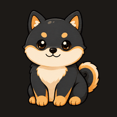

  

<h1 align="center">Mongle (몽글)</h1>

  <b>코딩하는 당신 옆의 몰랑한 데스크톱 펫</b> 
  AI 코딩 에이전트가 일하면 같이 일하고, 끝나면 점프하며 알려줍니다.

  
  
  
  
  

---

## 최근 업데이트

### 0.6.3

- **완료 작업 토큰 배지** — 최근 활동의 완료 행에서 `IN`·`OUT`·`CACHE` 토큰을 간결하게 표시하고, 비용이 기록된 OMO·GJC 작업은 `COST`도 보여줍니다.
- 값이 없는 항목은 숨기고, 긴 숫자는 `136.9K`, `1.37M`처럼 줄여 작은 창에서도 자연스럽게 줄바꿈됩니다. 배지에 마우스를 올리면 정확한 수치를 확인할 수 있습니다.
- 앱을 다시 실행한 뒤 기존 Codex·GJC·OMO 세션을 이어서 작업해도 프로젝트명이 최근 활동 행에 유지됩니다.

### 0.6.2

- **GJC 재개 세션 감지 수정** — 예전에 만든 세션을 다시 열어도 현재 로그 활동을 기준으로 정상 감지합니다.
- Orca에서 여러 프로젝트를 동시에 실행할 때 오래된 GJC 세션을 쓰는 프로젝트만 최근 활동에서 누락되던 문제를 해결했습니다.

### 0.6.1

- **OMO native 감지 복구** — OMO의 현재 세션 경로(`~/.omo/agent/sessions`)와 사용자 지정 설정 경로를 지원합니다.

### 0.6.0

- **최근 활동 창** — 에이전트와 프로젝트별 작업 시작·진행·완료·알림·오류를 한곳에서 확인할 수 있습니다.
- 서브에이전트를 부모 작업 아래에 묶고, 모델·프롬프트 미리보기·실행 시간을 표시합니다.
- **사용량 HUD 개선** — 로그인 계정과 에이전트 그룹을 표시하고 Codex · Claude · GJC · OMO 상태를 더 정확하게 구분합니다.

### 0.5.16

- **OMO native 연동** — OMO를 자동 감지하고 생각·도구 실행·완료·모델·서브에이전트 상태에 반응합니다.
- 트레이 메뉴에서 OMO 연동을 개별적으로 켜거나 끌 수 있습니다.

### 0.5.15

- **깍지 추가** — 블랙 앤 크림 말티푸 캐릭터와 21개 장면을 추가했습니다.
- 깜박임, 하품, 수면, 작업 인트로·루프 등 깍지 전용 애니메이션 타이밍을 적용했습니다.

## 이런 앱이에요

투명한 창에 사는 작은 펫이 화면 위를 돌아다닙니다. 클릭은 몸 위에서만 받고, 나머지는 전부 뒤 창으로 통과 — **작업을 전혀 방해하지 않아요.**

### 🤖 AI 코딩 에이전트와 함께 일해요

**Claude Code · Codex · GJC · OMO**를 자동으로 감지합니다. 설정할 것 없어요.

| 에이전트 상황 | 펫의 반응 |
|---|---|
| 생각(추론) 중 | 생각 구름 ☁️ 띄우고 같이 고민 |
| 도구·코드 실행 중 | 노트북 펴고 타닥타닥 💻 |
| 서브에이전트 투입 | 펫 옆에 **미니 클론들이 뿅** 나타나 같이 타닥타닥 — 끝나면 한 마리씩 퇴장 👯 |
| 작업 완료 | 점프! + ✅ "다 했어요!" |
| 질문·권한 요청 | 멍멍! + 알림 카드 ❓ |
| 에러 | 시무룩 ⚠️ |

긴 작업 걸어놓고 커피 타러 가세요. **끝나면 펫이 알려줍니다.**
여러 세션을 동시에 돌려도 알림 카드가 세션별로 쌓여서 놓치지 않아요.

트레이의 **최근 활동** 창에서는 여러 프로젝트의 작업 시작·완료·오류, 사용 모델, 실행 시간을 한곳에서 확인할 수 있어요. 완료된 작업은 입력·출력·캐시 토큰과 OMO·GJC 비용을 작은 배지로 함께 보여줍니다. 오래전에 만든 Codex·GJC·OMO 세션을 다시 열어 작업해도 현재 로그 활동을 기준으로 감지하고 프로젝트명을 유지합니다.

### 📊 사용량 HUD

Codex와 Claude의 남은 사용량과 리셋 시각을 보여주는 작은 위젯도 함께 제공됩니다.

- 설치된 에이전트만 표시되며, Codex만 있으면 한 줄, Claude만 있으면 한 줄, 둘 다 있으면 각각 표시됩니다.
- 위젯은 기본적으로 주 모니터 우하단에 나타나고, 드래그해서 원하는 위치에 놓을 수 있습니다.
- Codex는 로컬 세션 로그의 `rate_limits`를 읽고, Claude는 Claude Code가 로컬에 저장한 OAuth 토큰으로 공식 사용량 API를 조회합니다.
- Claude 토큰을 직접 갱신하거나 세션·파일·작업 내용을 전송하지 않습니다.

### 🐾 에이전트가 없어도 살아있어요

- 클릭하면 갸웃, 더블클릭하면 멍멍, 계속 귀찮게 하면 삐짐
- 드래그하면 대롱대롱 — 말랑한 젤리 물리
- 파일을 떨어뜨리면 물어와서 자랑 (내용은 읽지 않아요)
- 커서를 눈으로 졸졸 따라다님
- 심심하면 하품하고, 앉고, 옆으로 산책 나가고, 조용하면 쿨쿨
- 화면 가장자리에 붙이면 빼꼼 미니 모드

## 캐릭터

|  |  |  |  |  |
|:---:|:---:|:---:|:---:|:---:|
| **보영** — 애프리콧 푸들 🐩 | **호랑** — 아기 호랑이 🐯 | **룽지** — 시바 🐕 | **초코** — 블랙 앤 탄 시바 🐕 | **깍지** — 블랙 앤 크림 말티푸 🐩 |

새 캐릭터가 계속 추가될 예정이에요.

## 설치

현재 개발 빌드: **0.6.3**

1. [Releases](../../releases)에서 최신 `Mongle Setup x.x.x.exe` 다운로드
2. 실행 중인 Mongle을 트레이 메뉴에서 완전히 종료
3. 설치 파일 실행 — 기존 모든 사용자 설치를 업그레이드한다면 관리자 권한으로 실행
3. Windows SmartScreen 경고가 뜨면 **"추가 정보" → "실행"** (아직 미서명 베타 빌드예요)

- **지원**: Windows 10 / 11
- **업데이트**: 설치하면 자동 업데이트로 최신 버전 유지
- **삭제**: 프로그램 추가/제거에서 제거 (설정은 보존)

> 🚧 현재 **비공개 베타** 중입니다 — 릴리스가 보이지 않으면 아직 초대 배포 단계예요.

## 언어

한국어 · English · 日本語 · 简体中文 · 繁體中文 — 트레이 메뉴에서 변경.

## 프라이버시

- 에이전트 감지는 **내 컴퓨터의 세션 로그를 읽기만** 합니다 (수정·전송 없음)
- 타이핑 반응은 **기본 꺼짐**(opt-in)이고, 켜도 키 내용은 절대 수집하지 않아요 (타임스탬프만)
- Mongle 자체 서버로 세션·파일·키 입력 내용을 보내지 않습니다. 업데이트 확인과 사용량 HUD의 공식 사용량 조회만 네트워크를 사용합니다.
- 사용량 HUD가 켜져 있으면 Claude Code가 로컬에 저장한 OAuth 토큰으로 Anthropic 사용량 API를 조회합니다. 토큰을 직접 갱신하지 않으며 세션 내용은 전송하지 않습니다.
- 모든 연동은 메뉴에서 개별적으로 끌 수 있어요

## 문의

버그 제보·기능 제안: [Issues](../../issues)

---

<b>English</b>

**Mongle** is a squishy desktop pet that lives on your screen and reacts to your AI coding agents — **Claude Code, Codex, GJC, and OMO** are detected automatically with zero setup. It thinks along while the agent reasons, types along while tools run, and jumps with a ✅ bubble when the job is done, so you can walk away from long tasks. When your agent spawns subagents, tiny clones pop up beside the pet and type along, each one leaving as its subagent finishes. Notification cards stack per session, so nothing gets lost when you run agents in parallel.

The **Recent Activity** window groups work across projects and agents with status, model, duration, and project details. Completed rows show compact input, output, and cache-token badges; OMO and GJC rows also show cost when available. Resumed Codex, GJC, and OMO sessions keep their project labels even when Mongle starts after the session was created.

**Recent updates (0.5.15–0.6.3)**: Kkakji, a black-and-cream Maltipoo with 21 animated scenes; native OMO session monitoring; a cross-project Recent Activity window with nested subagent tasks, model, prompt, duration, token, cache, and cost details; clearer signed-in account and usage-HUD status; corrected OMO session discovery; and reliable project labels for resumed Codex, GJC, and OMO sessions.

A small usage HUD can show the remaining Codex and Claude quota plus reset times. It only shows agents installed on the machine, can be dragged anywhere, reads Codex `rate_limits` from local session logs, and queries Claude's official usage endpoint with the OAuth token Claude Code stores locally. Mongle never refreshes that token or sends session contents.

No agent? It's still alive: it tilts its head when clicked, dangles with jelly physics when dragged, fetches dropped files, follows your cursor with its eyes, strolls across the screen, and naps when things are quiet.

**Install**: quit Mongle from the tray, then run the latest `Mongle Setup x.x.x.exe` from [Releases](../../releases) on Windows 10/11. Run it as administrator when upgrading an existing all-users installation. If SmartScreen warns, choose "More info → Run anyway" (unsigned beta). Auto-updates included.

**Privacy**: agent detection only *reads* local session logs; the optional typing reaction (off by default) never collects key contents; Mongle does not send session, file, or keystroke contents to its own servers. Update checks and the optional quota request are the only network activity. When the usage HUD is enabled, Claude's locally stored OAuth token is used to read quota from Anthropic's official usage endpoint; the token is never refreshed by Mongle.

Characters: **Boyo** the apricot poodle 🐩, **Horang** the tiger cub 🐯, **Rungji** the shiba 🐕, **Choco** the black-and-tan shiba 🐕, and **Kkakji** the black-and-cream Maltipoo 🐩 — more on the way. Languages: KO · EN · JA · zh-CN · zh-TW.

